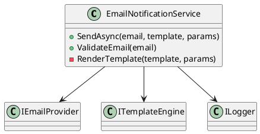
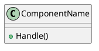

# Documentation Agent

**Documentation Agent** — агент для автоматической генерации технической документации компонентов с помощью LLM. Генерирует комплексную документацию в различных форматах:

- **Markdown** — полная текстовая документация с разделами (Overview, Responsibilities, Usage и т.д.)
- **Структурированный JSON** — метаданные компонента (ответственности, ключевые методы, зависимости)
- **PlantUML диаграммы** — UML-диаграммы классов в текстовом формате и PNG изображениях

Агент использует LLM для генерации контента, но при ошибках или отсутствии LLM автоматически переключается на fallback-режим с базовой заглушкой.

---

## Основные возможности

1. **Генерация Markdown документации** — создаёт структурированную документацию с разделами:
   - Обзор компонента
   - Ответственности
   - Использование
   - Ключевые методы/интерфейсы
   - Зависимости

2. **Генерация структурированных данных** — извлекает метаданные в JSON формате:
   - Название компонента
   - Описание
   - Список ответственностей (3-7 пунктов)
   - Ключевые методы/интерфейсы
   - Зависимости от других компонентов
   - Дополнительные заметки

3. **Генерация UML диаграмм** — создаёт PlantUML диаграммы классов:
   - Текстовый формат PlantUML (для версионирования и редактирования)
   - PNG изображение в base64 (для визуализации)

4. **Отказоустойчивость** — при ошибках LLM или отсутствии конфигурации автоматически использует fallback-заглушку

---

## MCP tool: `generate_docs`

**Название tool:** `generate_docs`

### Входные параметры

```json
{
  "componentName": "MyService",
  "description": "Сервис для обработки пользовательских данных и интеграции с внешними API"
}
```

**Параметры:**

- `componentName` (string, обязательный) — имя компонента/сервиса, для которого генерируется документация
- `description` (string, обязательный) — краткое описание функциональности компонента
- `ct` (CancellationToken, опциональный) — токен отмены операции

---

## Выходные данные

Агент возвращает объект `DocumentationResult` со следующей структурой:

```json
{
  "markdown": "# MyService\n\n## Overview\n\nСервис для обработки...",
  "umlPlantUml": "@startuml\nclass MyService {\n  + ProcessData()\n  + GetUserInfo()\n}\n@enduml",
  "umlPlantUmlImageBase64": "iVBORw0KGgoAAAANSUhEUgAA...",
  "structuredJson": {
    "componentName": "MyService",
    "description": "Сервис для обработки пользовательских данных",
    "responsibilities": [
      "Обработка пользовательских данных",
      "Интеграция с внешними API",
      "Валидация входных данных"
    ],
    "keyMethods": [
      "ProcessData()",
      "GetUserInfo()",
      "ValidateInput()"
    ],
    "dependencies": [
      "IHttpClient",
      "ILogger",
      "IDatabaseRepository"
    ],
    "notes": "Требует настройки API ключей в конфигурации"
  }
}
```

**Поля результата:**

- `markdown` (string) — полная Markdown документация компонента
- `umlPlantUml` (string?) — PlantUML диаграмма в текстовом формате
- `umlPlantUmlImageBase64` (string?) — PNG изображение диаграммы в формате base64
- `structuredJson` (DocumentationJsonData?) — структурированные метаданные компонента

**Структура `DocumentationJsonData`:**

- `componentName` (string) — название компонента
- `description` (string) — описание компонента
- `responsibilities` (List<string>) — список основных ответственностей (3-7 пунктов)
- `keyMethods` (List<string>) — список ключевых публичных методов/интерфейсов
- `dependencies` (List<string>) — список зависимостей или связанных компонентов
- `notes` (string?) — дополнительные заметки (опционально)

---

## Как использовать

### 1. Через MCP Server 

Агент доступен как MCP tool `generate_docs` и может быть вызван через MCP клиент:

```csharp
var result = await mcpClient.CallToolAsync<DocumentationResult>(
    "generate_docs",
    new
    {
        componentName = "UserService",
        description = "Сервис для управления пользователями"
    },
    ct: cancellationToken);
```

### 2. Прямое использование агента

```csharp
// Создание агента с LLM
var agent = new DocumentationAgent(chatClient, logger);

// Генерация документации
var result = await agent.GenerateAsync(
    componentName: "PaymentProcessor",
    description: "Обработчик платежей с поддержкой множественных провайдеров",
    ct: cancellationToken);

// Использование результата
Console.WriteLine(result.Markdown);
Console.WriteLine(result.UmlPlantUml);
var imageBytes = Convert.FromBase64String(result.UmlPlantUmlImageBase64);
```

### 3. Fallback режим (без LLM)

Агент может работать без LLM, используя базовую заглушку:

```csharp
// Создание агента без LLM (fallback режим)
var agent = new DocumentationAgent();

// Генерация базовой документации
var result = await agent.GenerateAsync(
    componentName: "TestComponent",
    description: "Тестовый компонент");
```

---

## Примеры использования

### Пример 1: Генерация документации для сервиса

**Входные данные:**
```json
{
  "componentName": "EmailNotificationService",
  "description": "Сервис для отправки email уведомлений пользователям"
}
```

**Выходные данные (Markdown):**
```markdown
# EmailNotificationService

## Overview

Сервис для отправки email уведомлений пользователям. Поддерживает шаблонизацию сообщений и асинхронную отправку.

## Responsibilities

- Отправка email уведомлений пользователям
- Шаблонизация сообщений
- Обработка очереди отправки
- Логирование результатов отправки

## Usage

```csharp
var service = new EmailNotificationService();
await service.SendAsync(userEmail, templateId, parameters);
```

## Dependencies

- IEmailProvider — провайдер отправки email
- ITemplateEngine — движок шаблонов
- ILogger — логирование
```

**Выходные данные (PlantUML):**


### Пример 2: Использование в PM Agent

Documentation Agent часто используется PM Agent для генерации документации компонентов в рамках анализа PR:

```json
{
  "ToolResults": {
    "2": {
      "markdown": "# PmAgent\n\nPM orchestrates tools via MCP...",
      "umlPlantUml": "@startuml\nclass PmAgent\n@enduml",
      "structuredJson": {
        "componentName": "PmAgent",
        "description": "PM orchestrates tools via MCP",
        "responsibilities": ["Orchestration", "Planning", "Aggregation"]
      }
    },
    "generate_docs_usedFallback": false
  }
}
```

---

## Технические детали

### Таймауты

- Таймаут для каждого LLM запроса: **30 секунд**
- При превышении таймаута агент переключается на fallback режим

### Обработка ошибок

Агент использует многоуровневую обработку ошибок:

1. **Проверка конфигурации LLM** — если LLM не настроен, сразу используется fallback
2. **Валидация JSON ответов** — при невалидном JSON выполняется попытка исправления через LLM
3. **Извлечение PlantUML** — автоматическое извлечение PlantUML кода из ответа LLM (с поддержкой markdown code fences)
4. **Fallback на заглушку** — при любых ошибках возвращается базовая документация

### Зависимости

- `Microsoft.Extensions.AI` — интеграция с LLM
- `PlantUml.Net` — генерация PNG изображений из PlantUML
- `System.Text.Json` — сериализация/десериализация JSON

---

## Fallback режим

При отсутствии LLM или ошибках генерации агент возвращает базовую заглушку:

**Markdown:**
```markdown
# ComponentName

_Заглушка документации._

Описание компонента

## Что будет дальше

В будущем сюда будет подставляться сгенерированная документация
по коду и UML-диаграмма.
```

**PlantUML:**


**StructuredJson:**
```json
{
  "componentName": "ComponentName",
  "description": "Описание компонента",
  "responsibilities": [],
  "keyMethods": [],
  "dependencies": [],
  "notes": null
}
```

---


